# Architecture

How `bifrost-sdk` sits between the agent platform's services and a Bifrost gateway, what is
inside it, and its key flows as sequence diagrams: a completion under a virtual key (and under
the deny-all MCP scope), a stream, listing and running MCP tools, a Virtual MCP with a
forwarded caller header, and stored prompts and skills. It is also the one home of the error
vocabulary, the retry policy and the circuit breaker. Method-level reference is in
[api.md](api.md); the decisions behind the design are the [ADRs](adr/README.md).

Contents: [among the five Trellis repos](#among-the-five-trellis-repos) ·
[where it sits](#where-it-sits) · [inside the package](#inside-the-package) ·
[a chat completion](#a-chat-completion-with-a-virtual-key) ·
[the deny-all MCP scope](#a-completion-never-gets-the-gateways-mcp-tools) ·
[MCP tools](#listing-and-calling-mcp-tools) ·
[Virtual MCPs and forwarded headers](#a-virtual-mcp-and-a-forwarded-caller-header) ·
[prompts and skills](#stored-prompts-and-skills) · [errors](#errors) ·
[retry policy](#retry-policy) · [circuit breaker](#the-circuit-breaker) ·
[design decisions](#design-decisions)

## Among the five Trellis repos

Trellis is five repos. This one is the platform's only way to a model or a gateway MCP tool:

| Repo | What it is | Relation to bifrost-sdk |
|---|---|---|
| [agent-harness](https://github.com/amitmohapatra/agent-harness) | runs your agent (any framework) with memory, runs, governance, tools and evals | imports it (`bifrost-sdk>=0.3`) for MCP tools, tool execution, MCP logs and completions |
| [agent-memory-service](https://github.com/amitmohapatra/agent-memory-service) | memory, context and feedback for agents | imports a vendored copy (`bifrost-sdk>=0.2`) for its own model calls |
| [agent-runs](https://github.com/amitmohapatra/agent-runs) | durable runs, the inbox, schedules, workers, webhooks | none: runs make no model calls |
| [agent-contracts](https://github.com/amitmohapatra/agent-contracts) | the shared records and ports | none either way; its `classify()` maps this SDK's exceptions by class name, and `AgentError.of` keeps their `retryable` |
| **bifrost-sdk** (this repo) | the client for the Bifrost model and MCP gateway | — |

The SDK reads no environment variable. The repos that use it read `BIFROST_URL` (the
gateway's `/v1` URL) and `BIFROST_VIRTUAL_KEY` themselves and pass them to the constructor
([configuration.md](configuration.md#the-names-the-other-repos-use)).

## Where it sits

The gateway owns every credential and every policy: provider keys, virtual keys with their
model and MCP allow-lists, budgets, routing rules, stored prompts. The SDK owns none of them.
It turns a call into the right HTTP request on the right one of the gateway's three surfaces,
and turns the answer — or the failure — into a small, typed vocabulary.

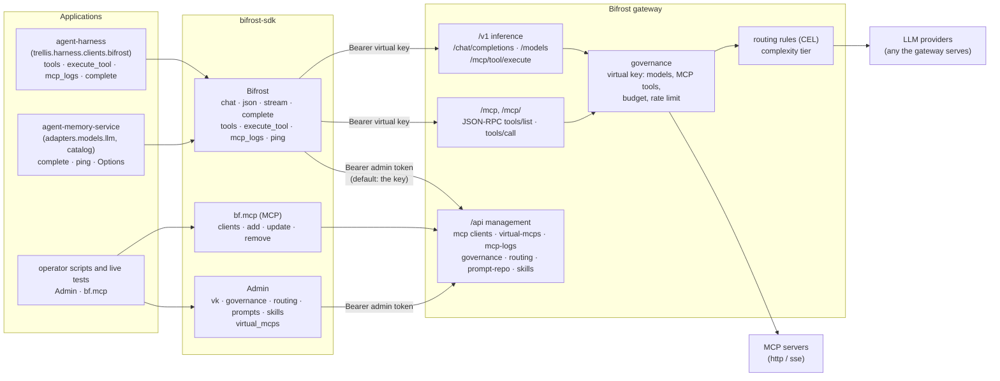

Who imports it, and how:

| Repository | Uses | How it depends on it |
| --- | --- | --- |
| `agent-harness` | `Bifrost` (`tools`, `execute_tool`, `mcp_logs`, `complete`), `Options`, `ToolDef`, `ToolAnnotations`, `MCPLog`; live tests use `Admin` and `bf.mcp` | path dependency on `../bifrost-sdk` (editable) |
| `agent-memory-service` | `Bifrost` (`complete`, `ping`), `Options`, `RETRYABLE`, the error classes | a vendored copy in `vendor/bifrost-sdk`, generated by `make vendor`; its `tests/unit/test_vendored_sdk.py` fails until the copy is refreshed after any change here |

## Inside the package

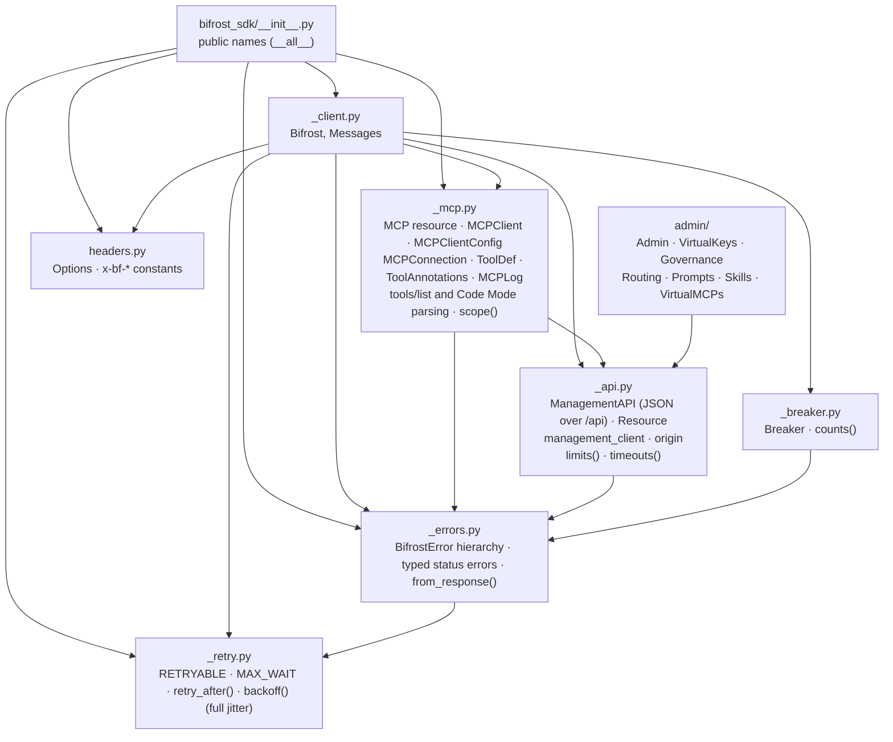

- `Bifrost` holds two httpx clients: one rooted at `base_url` (`/v1`, plus `/mcp` on the
  same origin) that carries the virtual key, and one rooted at the origin for `/api/*` that
  carries the admin token. `Admin` holds only the second kind. Every client the package
  builds gets `_api.limits()` (at most 100 connections, 20 idle kept for 30 s) and
  `_api.timeouts()` (connect `min(5, timeout)`; read, write and pool `timeout`).
- Everything under `/api/*` goes through `ManagementAPI`: one request, no retries, the shared
  error mapping, envelope unwrapping for list endpoints. `MCP` and each admin namespace are a
  `Resource` bound to it.
- `_errors.from_response` is the one place an error status becomes an exception: 429 is
  `RateLimitedError` (with the delay from `_retry.retry_after`), 400/401/403/404/409/422 and
  5xx have a `GatewayError` subclass each, and any other status at or above 400 is a plain
  `GatewayError`. Transport failures become `Unreachable`. See [Errors](#errors).

## A chat completion with a virtual key

`chat`, `json` and `complete` share `_post`: one body, the same retries, the same breaker.

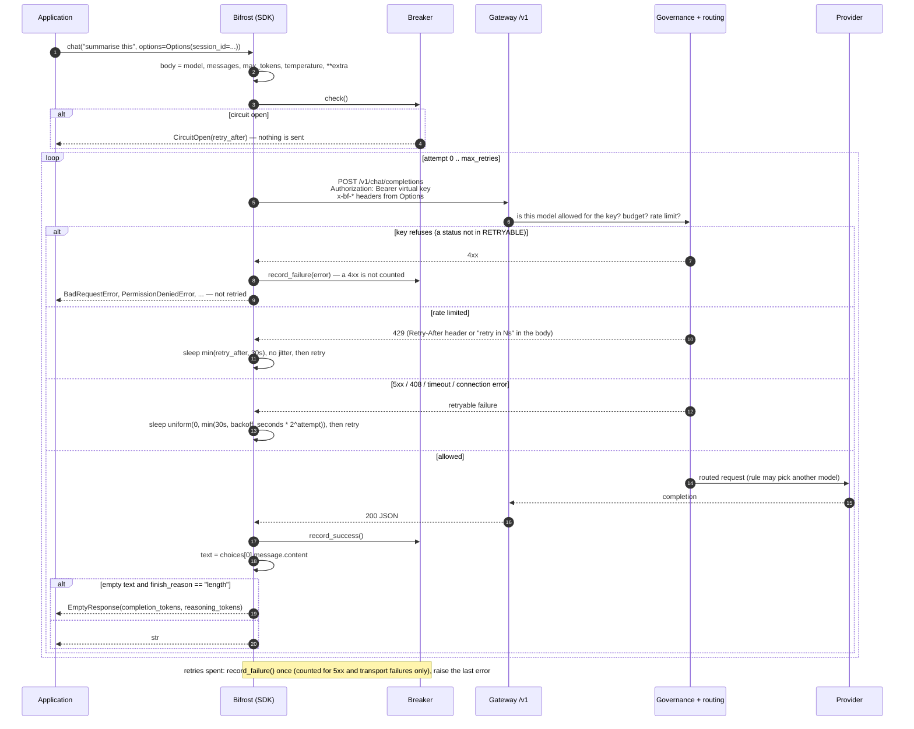

`complete` returns the 200 payload as it is, instead of extracting the text. `stream` sends
the same body with `"stream": true` through `httpx.stream` and yields each `data:` chunk's
delta content as it arrives. It has no retry loop, but it does go through the breaker:

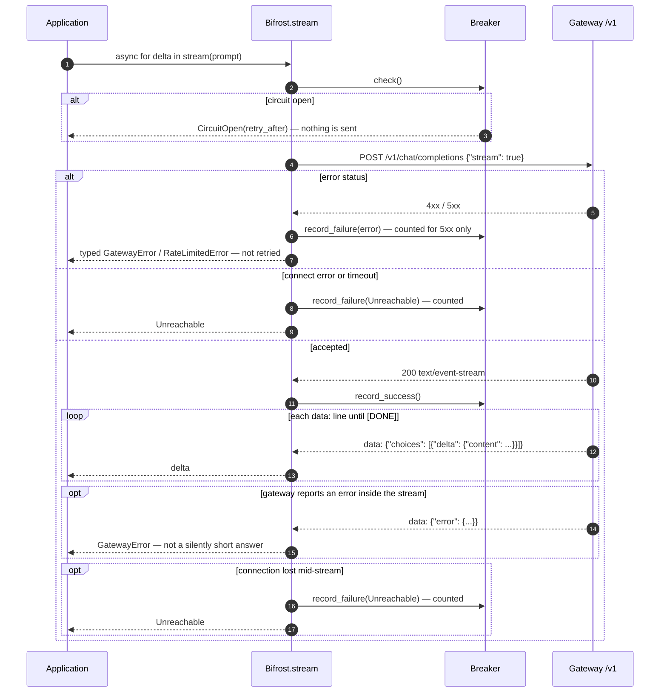

## A completion never gets the gateway's MCP tools

A virtual key with MCP access would, by default, have the gateway add the key's MCP tools to
every completion, and the gateway's own agent loop would run any call to a tool listed in a
client's `tools_to_auto_execute`, out of sight of the caller's governance. So every
completion carries the MCP scope headers present and empty, the gateway's deny-all
(`NO_GATEWAY_TOOLS`), and an `Options` that asks for a scope on a completion is refused
before anything is sent ([ADR 0003](adr/0003-completions-never-get-gateway-tools.md)).

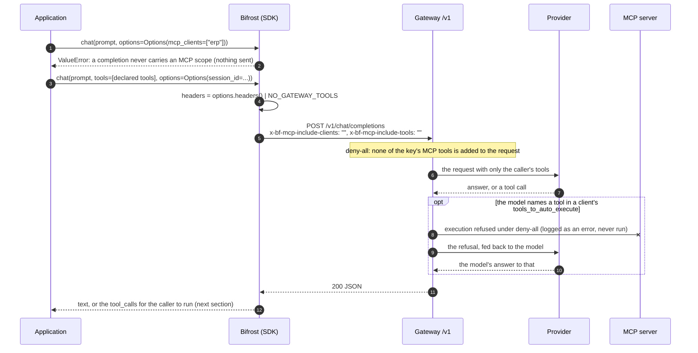

A framework's own model client pointed at the gateway (the harness's LangGraph or OpenAI
Agents models, for example) sends the same two headers as its default headers:
`bifrost_sdk.NO_GATEWAY_TOOLS`. No header turns the gateway's agent loop off, so keep
`tools_to_auto_execute` empty, which `MCPClientConfig` does by default.

## Listing and calling MCP tools

The gateway lists MCP tools to a virtual key only on its own MCP endpoint; `/api/*` is closed
to a virtual key when admin auth is on. `/mcp/<slug>` narrows the endpoint to one Virtual MCP
(or one client's own endpoint); `tools(slug=)` and `execute_tool(slug=)` go there. Every
completion carries the MCP scope headers empty (deny-all), so the gateway adds no MCP tool to
it and refuses any its agent loop would run: the application lists the tools, offers them,
and runs each call, so its policy and approval sit in front.

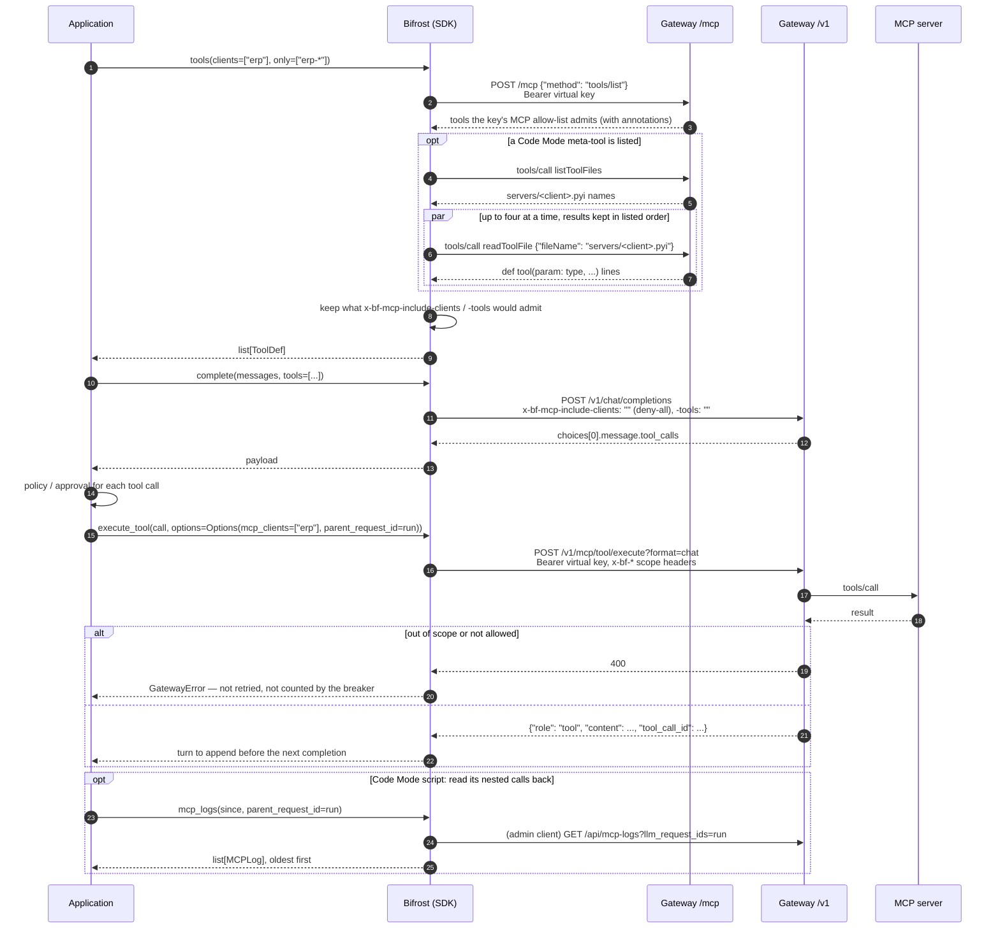

## A Virtual MCP and a forwarded caller header

A Virtual MCP is a bundle of tools from several MCP clients behind one endpoint,
`/mcp/<slug>`, reachable only by the virtual keys it is attached to. A header named in a
client's `allowed_extra_headers` is forwarded by the gateway to that server on every call, so
a per-user credential can travel with the call.

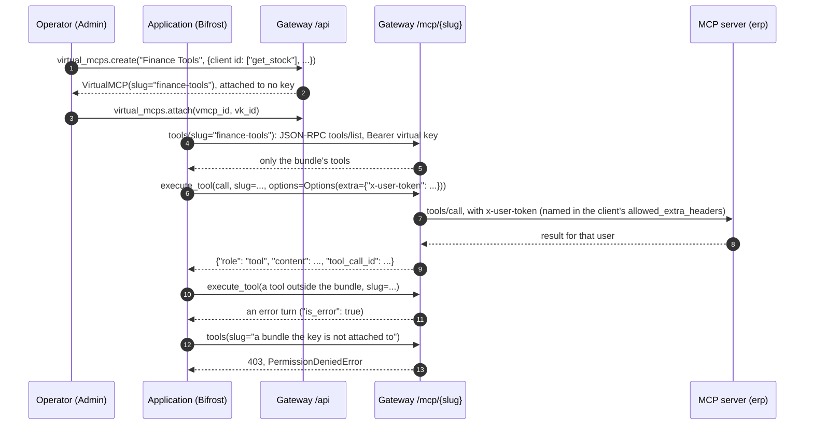

Clients the gateway authenticates per user (`per_user_headers`, `per_user_oauth`) key the
stored credential by the signed-in user, else the virtual key, else `mcp_session_id`. Under
one shared virtual key every caller is the same "user", so a credential per person needs a
key per person or a forwarded header ([api.md](api.md#per-request-options)).

## Stored prompts and skills

The gateway keeps prompts (versioned chat messages with model parameters) and Agent Skills
(a `SKILL.md` body with files). An operator writes them with `Admin`; an application selects
a prompt per request with `Options`, and the gateway prepends it.

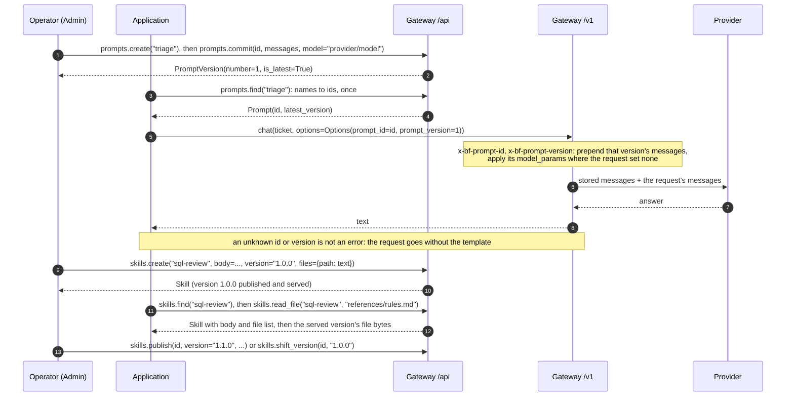

Versions only go up: a prompt version is the next number, and reusing a skill version is a 409
`ConflictError`. A skill file of a version that is not served cannot be read back.

## Errors

Every exception is a `BifrostError` and carries `retryable` (whether the same call may succeed
later); the contracts' `AgentError.of` reads it instead of re-deriving the rule. The typed
status errors subclass `GatewayError`, so existing `except GatewayError` code still catches
them; `RateLimitedError` subclasses `RateLimited` and deliberately not `GatewayError`, so code
that counts `GatewayError` as failure still never counts a 429.

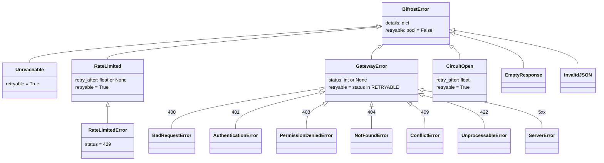

Any other error status (`408`, `413`, ...) is a plain `GatewayError`. The typed classes are
subclasses, so `except GatewayError` still catches every one of them.

Every error carries `retryable`: whether the *same* call may succeed if made again later.
It is `True` for `Unreachable`, `RateLimited`, `CircuitOpen`, and for a `GatewayError` whose
status is in `RETRYABLE` (`408, 409, 425, 500, 502, 503, 504`); `False` for everything else —
including a `501`, a `GatewayError` without a status, `EmptyResponse` and `InvalidJSON`.
Callers above this client read it rather than re-deriving the rule.

| Raised by | `Unreachable` | `RateLimited` | `GatewayError` | `CircuitOpen` | `EmptyResponse` | `InvalidJSON` |
| --- | --- | --- | --- | --- | --- | --- |
| `chat`, `complete`* | after retries | after retries | yes | yes | `chat` only | |
| `json` | after retries | after retries | yes | yes | yes | yes |
| `stream` | yes | yes | yes | yes | | |
| `tools`, `execute_tool`, `mcp_logs`, `bf.mcp.*`, `Admin.*` | yes | yes | yes | | | |
| `ping` | never raises | | | | | |

\* `complete` returns the payload as it is, so an empty answer is the caller's to read.
Invalid arguments (no model, a naive `since`, a tool call without a name, an unregistrable
MCP connection) raise `ValueError` before any request is sent.

```python
from bifrost_sdk import (
    BadRequestError,
    BifrostError,
    CircuitOpen,
    EmptyResponse,
    GatewayError,
    RateLimited,
)

try:
    text = await bf.chat(prompt)
except RateLimited as exc:  # healthy gateway asking for less: wait exc.retry_after
    ...
except CircuitOpen as exc:  # nothing was sent; the gateway was failing moments ago
    ...
except EmptyResponse:  # a reasoning model spent the budget: raise max_tokens
    ...
except BadRequestError:  # this request will never work as sent: change it
    ...
except GatewayError as exc:  # exc.status, exc.retryable, exc.details["body"]
    ...
except BifrostError:  # Unreachable, InvalidJSON
    ...
```

**Why a 429 is not a `GatewayError`.** A 429 means the gateway is healthy and saying so; the
circuit breaker does not count it, or "slow down" becomes "stop". Measured on a real run: 17
rate limits opened a breaker and the next 62 calls failed instantly without a request ever
being sent. Code that catches `GatewayError` to count failures has therefore never seen a
429, and the typed `RateLimitedError` keeps it so.

**Why `EmptyResponse` exists.** Reasoning models spend the output budget on thinking before
emitting anything, so too small a `max_tokens` returns 200 OK with `""` and
`finish_reason="length"`. Measured against one such model, "Reply with exactly: OK" consumed
57 reasoning tokens. Returning `""` would push a silently degraded answer into every call
site. Its `.details` carry `completion_tokens` and `reasoning_tokens`.

## Retry policy

Only `chat`, `json` and `complete` retry, on a status in `RETRYABLE` (`408, 409, 425, 429,
500, 502, 503, 504`) or a transport failure, up to `max_retries` times. Everything else is
the caller's mistake and is raised on the first attempt: retrying a 400 only spends the
budget. A `200` whose body is not JSON is a gateway fault: raised at once, counted by the
breaker.

The wait comes from `Retry-After` when the gateway sends one, as a delay or an HTTP date, and
from the *body* when it does not: some providers answer "Please retry in 59.18s" with no
header at all. No wait is longer than 30 seconds (`bifrost_sdk._retry.MAX_WAIT`), whoever
asked for it. The wait before each retry:

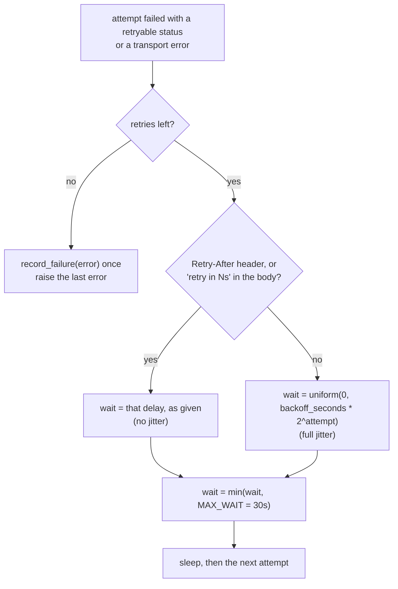

Full jitter, because the bare exponential is the same number in every process: when the
gateway comes back, every agent that failed in the same second would retry in the same
second. The gateway's own delay is not jittered — it says when there will be room.

## The circuit breaker

Retries handle one bad call; the breaker handles a bad gateway. It counts failed *calls*
(a call whose retries are all spent counts once), and only the failures that say the gateway
is unwell (`_breaker.counts`): transport failures, 5xx, and a 2xx with an unusable body. No
4xx counts — not 429 (backpressure), not 400/404/409/422 (a verdict on that request: a few
over-long prompts must not open the circuit for every agent sharing the client), and not
401/403 (one mis-keyed caller must not take the gateway away from correctly keyed ones). A
4xx neither adds to the streak nor resets it. `chat`, `json`, `complete` and `stream` use it;
tool execution and management calls do not.

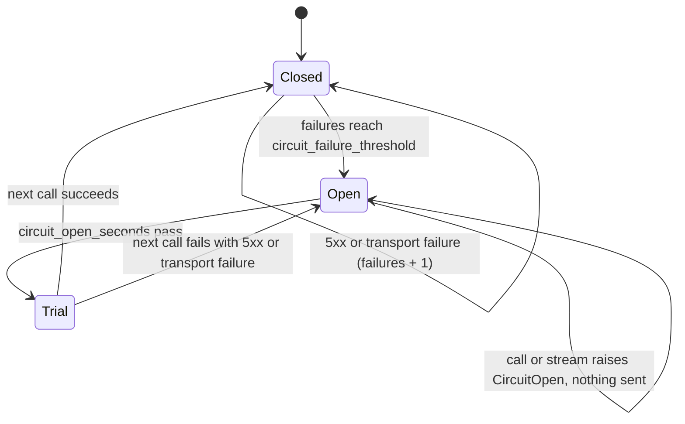

`circuit_failure_threshold=0` removes the breaker entirely.

## Design decisions

The three that shape the rest have ADRs: [0001](adr/0001-constructor-arguments-only.md) (no
environment reading), [0002](adr/0002-retries-and-the-circuit-breaker.md) (what is retried
and what trips the breaker) and [0003](adr/0003-completions-never-get-gateway-tools.md) (the
deny-all MCP scope on every completion).

- **The gateway holds the credentials.** The SDK sends a virtual key, never a provider key,
  and imports no provider SDK; changing provider is changing a model string.
- **A 429 is not a failure.** `RateLimited` (and `RateLimitedError`) is not a `GatewayError`
  and never trips the breaker; its delay comes from `Retry-After` or from the body, where
  some providers put it.
- **Only a sick gateway trips the breaker.** 5xx and transport failures count; a 4xx is a
  verdict on one request (or one key) and counts for nothing, so one caller's bad prompts or
  bad key cannot fail every other caller in the process.
- **Typed, not breaking.** Each common status has its own `GatewayError` subclass, and every
  error says whether it is `retryable`.
- **Only replayable things are retried.** Completions are; streams (the caller has already
  seen part of the text), tool executions (side effects) and management calls (mostly writes)
  are not.
- **No silent degradation.** An empty answer that ran out of budget is `EmptyResponse`, a
  reply that is not JSON is `InvalidJSON` or `GatewayError`, and a listing the gateway refuses
  is an error rather than an empty toolbox.
- **Deny-by-default is visible.** `MCPClientConfig.tools_to_execute` has no default, and
  `Admin.vk.create` sends `provider_configs` / `mcp_configs` only when given, so a key or
  client that permits nothing is a decision made at the call site.
- **Per-request behaviour is headers.** Everything the gateway does for one call is an
  `x-bf-*` header, built from `Options` so a misspelt header cannot be silently ignored.
- **The caller runs the tools.** A completion never gets the gateway's MCP tools: added tools
  would reach the model unseen, and the gateway's agent loop would run calls past the
  caller's governance and records. The MCP scope is for `execute_tool`; on a completion a
  non-empty one is refused.
