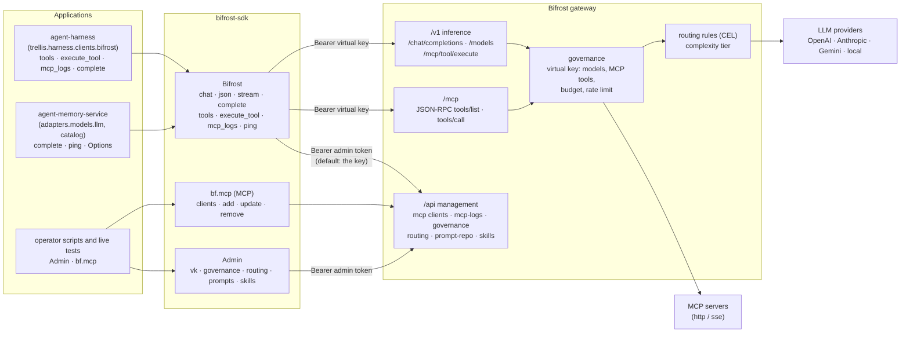
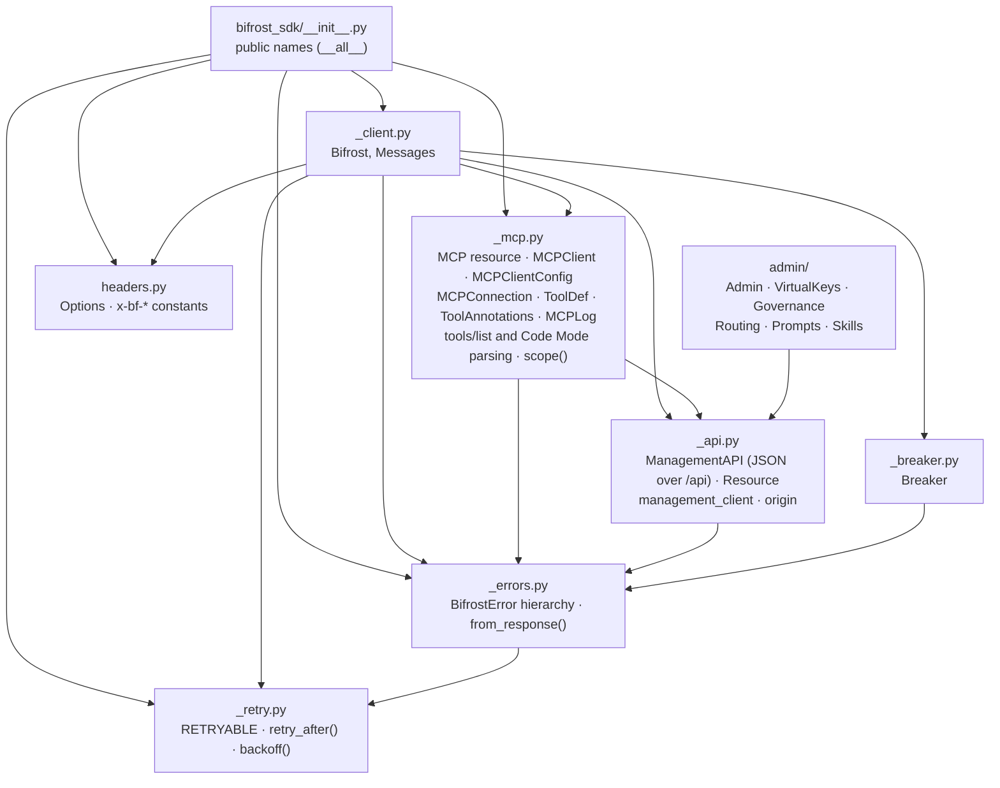
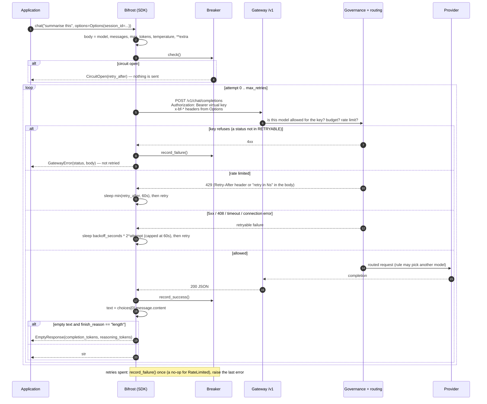
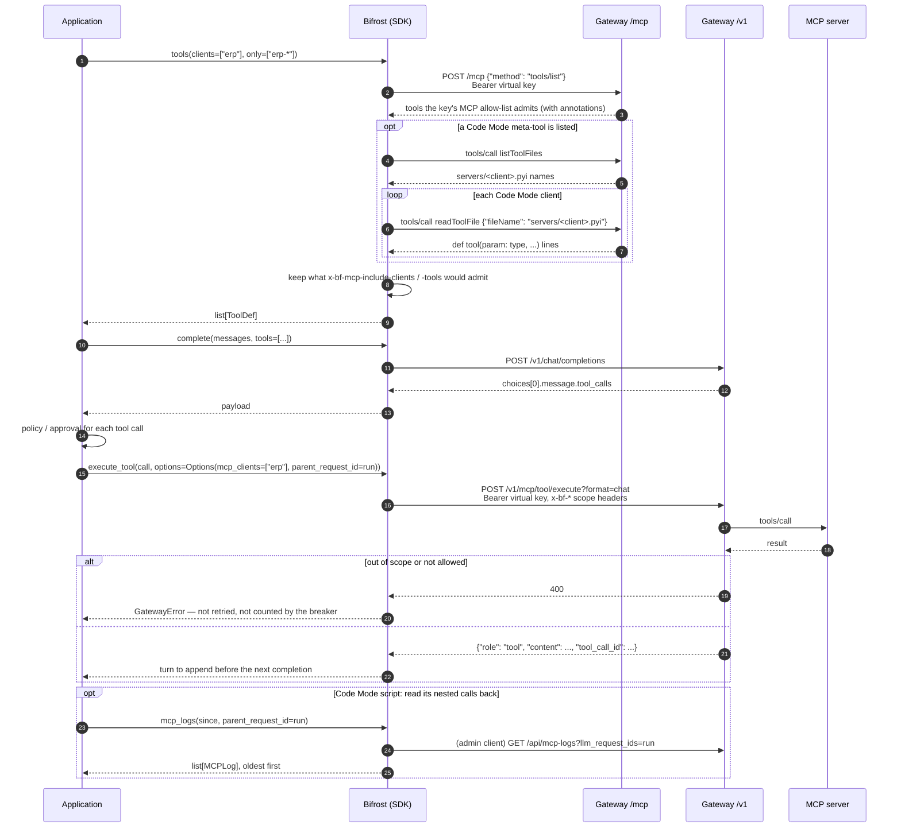
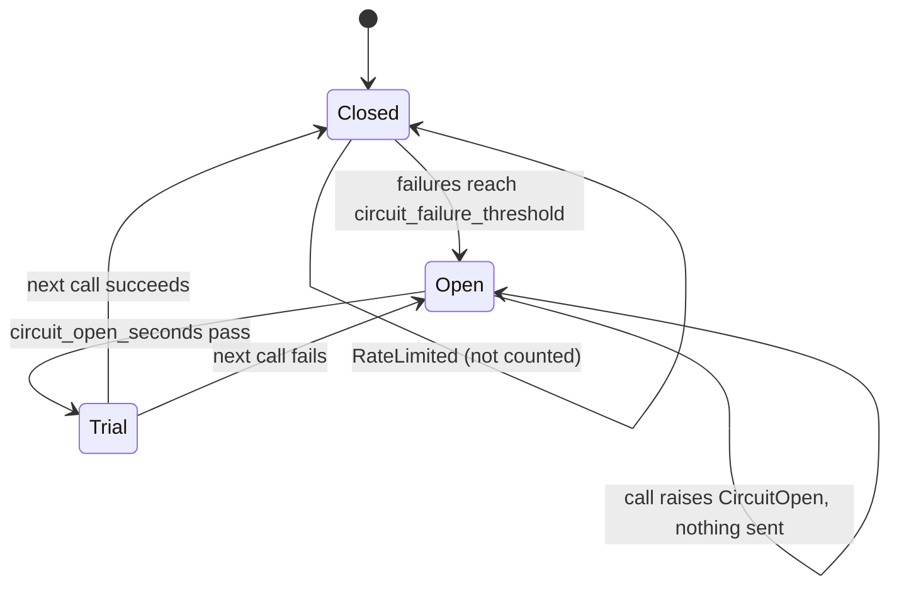

# Architecture

How `bifrost-sdk` sits between the agent platform's services and a Bifrost gateway, what is
inside it, and the two flows that matter most: a chat completion under a virtual key, and
listing and running MCP tools. Method-level reference is in the [README](../README.md).

## Where it sits

The gateway owns every credential and every policy: provider keys, virtual keys with their
model and MCP allow-lists, budgets, routing rules, stored prompts. The SDK owns none of them.
It turns a call into the right HTTP request on the right one of the gateway's three surfaces,
and turns the answer — or the failure — into a small, typed vocabulary.

Who imports it, and how:

| Repository | Uses | How it depends on it |
| --- | --- | --- |
| `agent-harness` | `Bifrost` (`tools`, `execute_tool`, `mcp_logs`, `complete`), `Options`, `ToolDef`, `ToolAnnotations`, `MCPLog`; live tests use `Admin` and `bf.mcp` | path dependency on `../bifrost-sdk` (editable) |
| `agent-memory-service` | `Bifrost` (`complete`, `ping`), `Options`, `RETRYABLE`, the error classes | a vendored copy in `vendor/bifrost-sdk`, generated by `make vendor`; its `tests/unit/test_vendored_sdk.py` fails until the copy is refreshed after any change here |

## Inside the package

- `Bifrost` holds two httpx clients: one rooted at `base_url` (`/v1`, plus `/mcp` on the
  same origin) that carries the virtual key, and one rooted at the origin for `/api/*` that
  carries the admin token. `Admin` holds only the second kind.
- Everything under `/api/*` goes through `ManagementAPI`: one request, no retries, the shared
  error mapping, envelope unwrapping for list endpoints. `MCP` and each admin namespace are a
  `Resource` bound to it.
- `_errors.from_response` is the one place an error status becomes an exception: 429 is
  `RateLimited` (with the delay from `_retry.retry_after`), anything else at or above 400 is
  `GatewayError`. Transport failures become `Unreachable`.

## A chat completion with a virtual key

`chat`, `json` and `complete` share `_post`: one body, the same retries, the same breaker.

`complete` returns the 200 payload as it is, instead of extracting the text. `stream` sends
the same body with `"stream": true` through `httpx.stream`, yields each `data:` chunk's delta
content as it arrives, and has no retry loop and no breaker.

## Listing and calling MCP tools

The gateway lists MCP tools to a virtual key only on its own MCP endpoint; `/api/*` is closed
to a virtual key when admin auth is on. Outside Agent Mode the gateway never runs a tool by
itself: the application runs each call, so its policy and approval sit in front.

## The circuit breaker

Retries handle one bad call; the breaker handles a bad gateway. It counts failed *calls*
(a call whose retries are all spent counts once) and ignores `RateLimited`.

`circuit_failure_threshold=0` removes the breaker entirely.

## Design decisions

- **The gateway holds the credentials.** The SDK sends a virtual key, never a provider key,
  and imports no provider SDK; changing provider is changing a model string.
- **A 429 is not a failure.** `RateLimited` is not a `GatewayError` and never trips the
  breaker; its delay comes from `Retry-After` or from the body, where Gemini puts it.
- **Only replayable things are retried.** Completions are; streams (the caller has already
  seen part of the text), tool executions (side effects) and management calls (mostly writes)
  are not.
- **No silent degradation.** An empty answer that ran out of budget is `EmptyResponse`, a
  reply that is not JSON is `InvalidJSON` or `GatewayError`, and a listing the gateway refuses
  is an error rather than an empty toolbox.
- **Deny-by-default is visible.** `MCPClientConfig.tools_to_execute` has no default, and
  `Admin.vk.create` sends `provider_configs` / `mcp_configs` only when given, so a key or
  client that permits nothing is a decision made at the call site.
- **Per-request behaviour is headers.** Everything the gateway does for one call is an
  `x-bf-*` header, built from `Options` so a misspelt header cannot be silently ignored.
